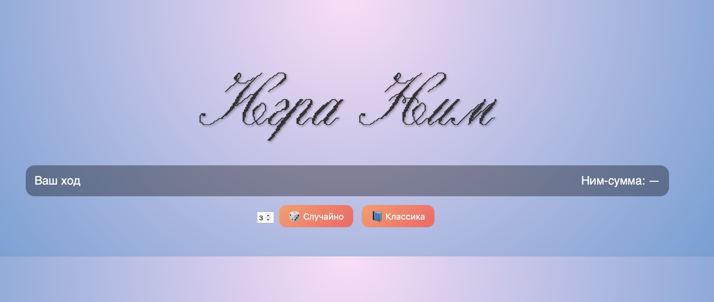

# 🎮 Игра Ним — интерактивная веб-версия

Добро пожаловать в **Ним** — современную веб-реализацию классической
математической игры с оптимальной стратегией и наглядной визуализацией.



Проект написан на **Python + Flask** с ярким **HTML / CSS / JavaScript** интерфейсом
и демонстрирует теорию игр, ним-сумму и оптимальные стратегии в игровой форме.

---

## 📸 Скриншоты


## 🧠 Правила игры:

- Есть несколько кучек с камнями  
- За один ход можно взять **любое количество камней (≥ 1)** из **одной кучки**  
- Игроки ходят по очереди  
- **Проигрывает тот, кто не может сделать ход** (все кучки пусты)

---

## ⚙️ Функционал

### 🎯 Игровая логика:
- Произвольное количество кучек  
- Классический пример **(3, 4, 5)**  
- Случайная инициализация игры  
- Автоматическое определение конца игры  

### 🤖 Искусственный интеллект:
- Использует **оптимальную стратегию Нима**  
- Вычисляет **ним-сумму (XOR)**  
- Делает выигрышные ходы при возможности  
- Делает случайный ход в проигрышной позиции  

### 🎨 Пользовательский интерфейс:
- Современный «мини-игровой» дизайн  
- Визуализация камней  
- Анимация исчезновения камней  
- Чёткий индикатор текущего хода:  
  - 🧑 **Ход игрока**  
  - 🤖 **Ход компьютера**  
- Сообщения о ходе компьютера  

---

## 🖥️ Используемые технологии

- **Python 3**
- **Flask**
- **HTML5**
- **CSS3**
- **JavaScript (ES6)**

---

## 🚀 Установка и запуск

### 1️⃣ Клонировать репозиторий
```bash
git clone https://github.com/ТВОЙ_НИК/nim-game.git
cd nim-game```

### 2️⃣ Установить зависимости
```bash
pip install flask```

### 3️⃣ Запустить сервер
```bash
python app.py```

### 4️⃣ Открыть в браузере
```cpp
http://127.0.0.1:5000```